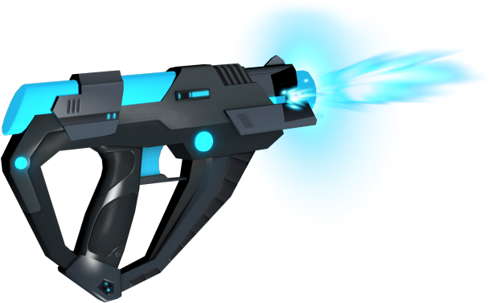

# A-Frame-Gun
The gun from A-Blast VR game reprogrammed to work with A-Frame Physics System.<br>
</img>

### Project Specifications:<br>
A-Frame 0.7.1<br>
A-Frame Particle System 1.0.10<br>
A-Frame Physics System 2.10.0<br>
A-Frame Animation Component 3.2.5<br>
A-Frame Gradient Sky 1.0.4<br>

### Compiling the Project<br>
Install Node.js version 9.20 or greater.<br>
Install Browserify using:<br>
```bat
npm install -g browserify
 ```
 Navigate to the project src folder then run the following, which will override the file build.js in the src directory:<br>
 ```bat
 browserify index.js -o build.js
 ```
 Finally, copy the resultant build.js file into the build folder and override the previous build.js. 
 
### Credit: <br>
Code reprograms the gun from A-Blast (Serrano et al., 2017); hence, it uses a significant amount of code from the original repository. https://github.com/aframevr/a-blast.

